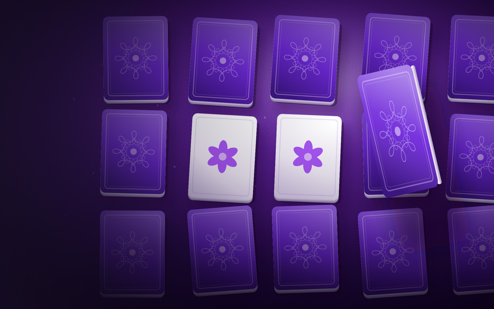
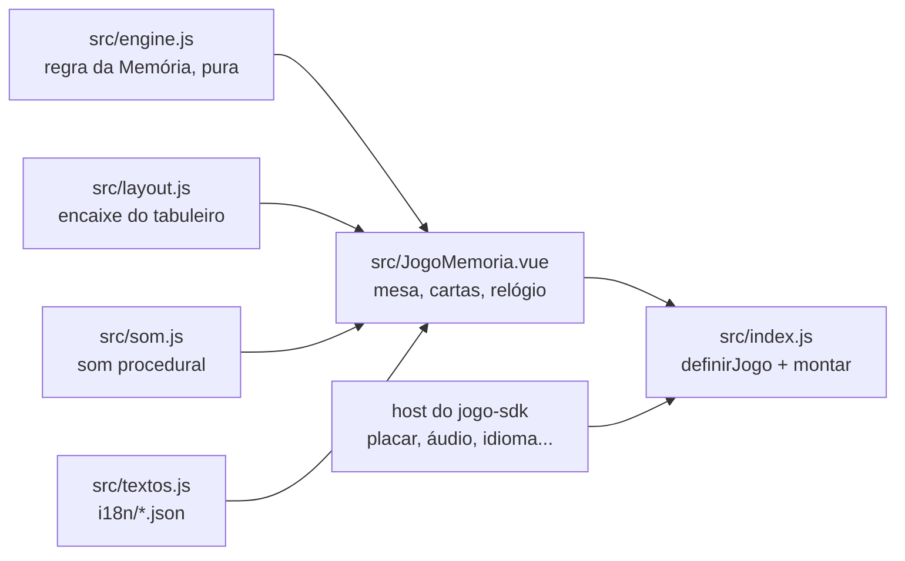

# Memória

A Memória do [RoqueOS](https://roqueos.com.br): vire as cartas, encontre os pares e suba de
nível. O tabuleiro cresce a cada nível, de 2 pares no primeiro a 15 no oitavo, e o placar
premia poucas jogadas, pares seguidos e rapidez. Jogue em
[roqueos.com.br/jogar/jogo-da-memoria](https://roqueos.com.br/jogar/jogo-da-memoria).

_English below._

## Por que existe

Até 25/09/2026 este jogo morava dentro do repositório do RoqueOS e importava as stores do
sistema direto. Agora ele é um repo próprio na organização
[roqueos-games](https://github.com/roqueos-games), aberto, e fala com o RoqueOS só pelo
[`jogo-sdk`](https://github.com/roqueos-games/jogo-sdk). O mesmo código roda no RoqueOS,
sozinho no seu navegador (`yarn dev`) e no teste.

## Arquitetura

- `src/engine.js` é a regra do jogo, sem Vue, sem DOM e sem `Math.random`: a semente decide o
  baralho, então toda partida é reproduzível no teste. Ele também guarda a rampa de níveis e
  a conta do placar.
- `src/layout.js` calcula o maior tabuleiro que cabe na janela sem distorcer as cartas, para
  ninguém precisar arrastar a mesa.
- `src/JogoMemoria.vue` desenha a mesa inclinada e as cartas, conta o tempo e ouve clique e
  toque. A Memória não tem controle de teclado. Tudo o que vem do sistema (recorde da conta,
  áudio, perfil de aparelho fraco, métrica, idioma) chega pelo `host`.
- `src/index.js` cria um app Vue próprio dentro do elemento que o host entrega e devolve
  `{ ativar, desmontar }`. O relógio só anda enquanto a janela está ativa.
- `jogo.json` é o manifesto: nome e descrição nos dez idiomas, SEO, etiquetas, capa, ícone e
  tamanho de janela. O RoqueOS confere que ele bate com o catálogo.

## Pré-requisitos

- Node 24 (o `.nvmrc` diz), ou 22 no mínimo.
- Yarn 1.22.

## Como rodar

1. `yarn install --ignore-scripts`
2. `yarn dev` e abra o endereço que o Vite mostrar: o jogo roda com o host de
   desenvolvimento do SDK, com o recorde no `localStorage`.
3. `yarn verificar` antes de abrir PR: lint, formato, testes e o `jogo check`, o mesmo que o
   CI roda.

## Estrutura

| Caminho              | O que é                                                               |
| -------------------- | --------------------------------------------------------------------- |
| `src/`               | o jogo (engine, encaixe, tela, som, ícones, textos, entrada)          |
| `i18n/`              | um JSON por idioma, com as mesmas chaves nos dez                      |
| `public/`            | capa e ícone; a origem de cada arquivo está no [ASSETS.md](ASSETS.md) |
| `test/`              | testes com o host falso do SDK, sem nada do RoqueOS                   |
| `dev/`, `index.html` | o jogo sozinho no navegador, para desenvolver                         |
| `jogo.json`          | o manifesto que o RoqueOS lê                                          |

## Onde ele se encaixa

O RoqueOS instala este repo por uma tag exata e monta o jogo pelo `mount` do SDK, na janela,
em `/jogar/jogo-da-memoria` e no modo TV. Uma mudança aqui só chega ao RoqueOS quando uma tag
nova é pinada lá, depois de revisada. As chaves de armazenamento (`best`, `muted`) e os nomes
de evento (`game_start`, `game_over`) não mudam: o recorde de quem já joga e o histórico de uso
dependem deles.

## Licença

MIT, no código e na arte própria. Veja [LICENSE](LICENSE) e [ASSETS.md](ASSETS.md).

---

## English

The Memory match game from [RoqueOS](https://roqueos.com.br): flip the cards, find the pairs
and level up, from 2 pairs on the first board to 15 on the eighth. It talks to RoqueOS only
through the [`jogo-sdk`](https://github.com/roqueos-games/jogo-sdk), so the same code runs
inside RoqueOS, standalone in your browser and in tests.

- `yarn install --ignore-scripts`, then `yarn dev` to play it locally.
- `yarn verificar` runs lint, formatting, tests and `jogo check`, exactly like CI.
- Code and comments are in Brazilian Portuguese; issues and pull requests in English are
  welcome.
- Storage keys (`best`, `muted`) and event names (`game_start`, `game_over`) are stable on
  purpose: existing players' records and analytics depend on them.

MIT licensed, code and original art.
